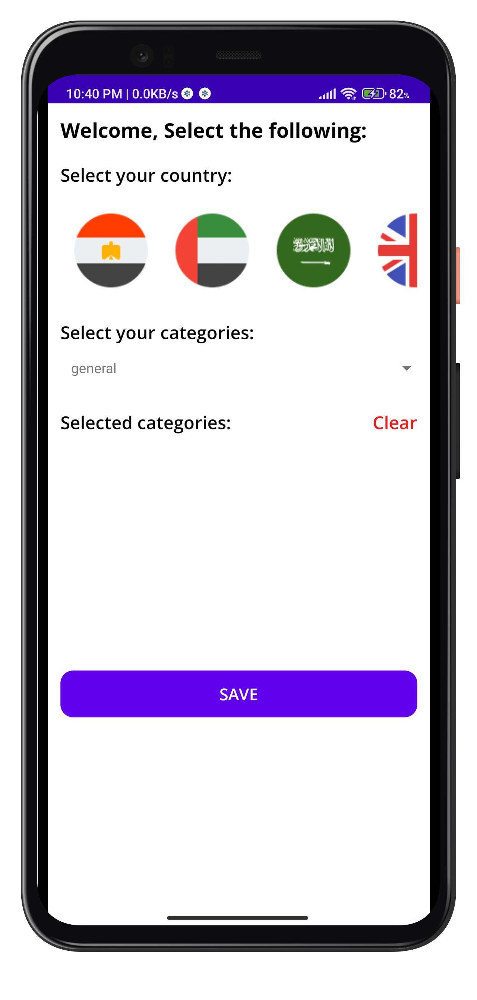

# Features
* User can select his country and 3 favourite categories, and can change them anytime.
* User can see Breaking news in his country and category news based on selected categories.
* User can search for article and select search category.
* User can share and save any article to view it later.
* User can see breaking news even if there is no internet connection.
* App support en/ar languages.

# Important note:
* if the category news is not loading or error HTTP429 in search page this means that we need to change the API key or wait 12 hours.

# Screenshots:
   

# Technologies & Open-source libraries
* Kotlin mainly, Coroutines together with Flow.
* Dependency injection (Dagger Hilt).
* Retrofit A type-safe HTTP client.
* Material design components
* JetPack:
	* Lifecycle
	* ViewModel
	* ViewBinding
  	* Room DB 
	* Navigation Component
* [SDP](https://github.com/intuit/sdp) to support different screen sizes.
* [Glide](https://github.com/bumptech/glide) very easy library to load images or thumnails.
* [SHIMMER](https://facebook.github.io/shimmer-android/) facebook posts loading effect.
* [SPINNER](https://github.com/jaredrummler/MaterialSpinner) Material spinner withh improved ui.

